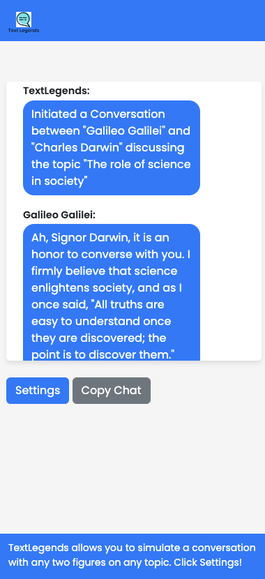

# GPT-Legends
Use GPT api to conduct conversations with legendary figures on a specific topic using their style.

# Text Legends

Text Legends is a web application that allows you to simulate a conversation between two legendary figures or about a topic using a GPT-based AI chat model.

## Features

- Conversations between legendary figures
- Simulated discussions about various topics
- Real-time conversation simulation using GPT chat model
- Debug mode to display API requests and responses

## Installation

1. Clone the repository:
https://github.com/edjamakated/GPT-Legends/

2. Set up your API Key and GPT chat model endpoint in `textlegends.php`.

3. Run the application using your preferred web server.

## Usage

1. Open the application in your browser.
2. Enter the names of two legendary figures and a topic for discussion.
3. Optionally, enter your API Key.
4. Click "Start Conversation" to simulate the conversation between the two figures.
5. Click "Show Debug" to display API requests and responses.

## Contributing

Pull requests are welcome. For major changes, please open an issue first to discuss what you would like to change.

## License

[MIT](LICENSE)
